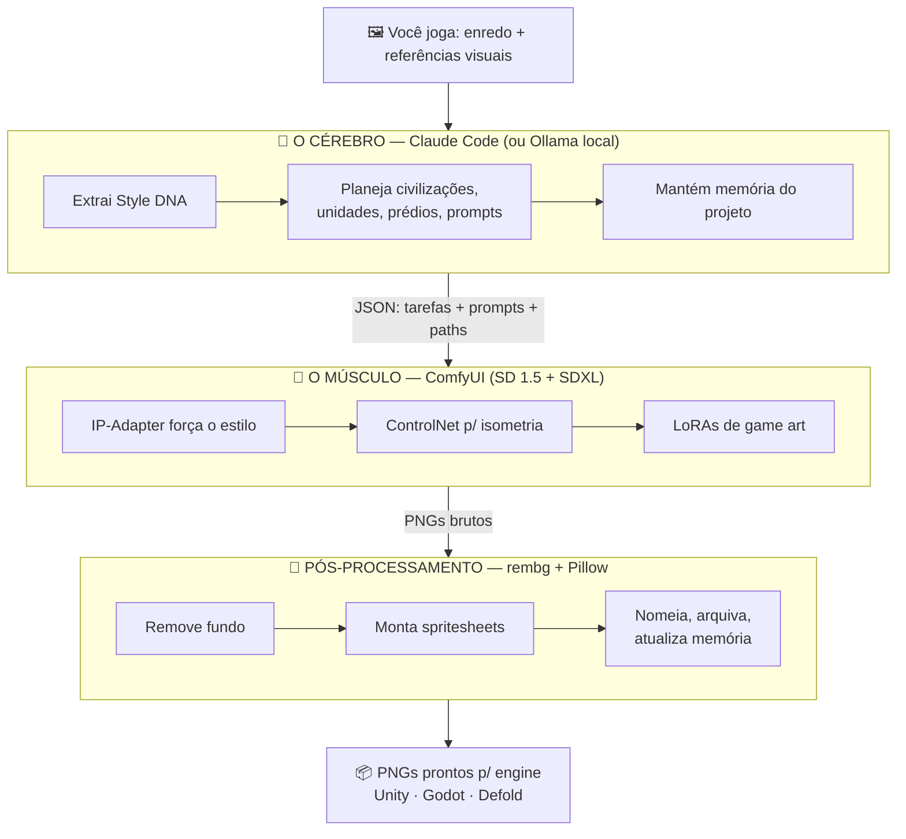

<div align="center">

# 🎨 AssetsMaker

**Um estúdio de arte de jogo inteiro rodando na sua própria máquina.**
*A whole game-art studio running on your own machine.*

[](https://www.python.org/)
[](https://github.com/comfyanonymous/ComfyUI)
[](https://stability.ai/)
[](https://www.anthropic.com/)
[](https://learn.microsoft.com/powershell/)
[](#)

🇧🇷 [**Português**](#-português) · 🇺🇸 [**English**](#-english)

</div>

---

## 🇧🇷 Português
<a name="-português"></a>

### O que é

**AssetsMaker** é um pipeline local e autossuficiente para gerar **toneladas de assets de jogo** — sprites isométricos, construções, terrenos, UI — com **consistência visual industrial**, **memória de projeto perpétua** e **vários jogos em paralelo**. É pensado para devs **não-artistas** que querem produzir um jogo descrevendo o conceito, jogando referências e deixando a IA executar como um time de arte interno.

Tudo roda **100% local, dentro da própria pasta, sem assinaturas, sem cloud**. A única coisa paga é a sessão de Claude Code que você já tem — e ele substitui o LLM local por um cérebro de qualidade muito superior.

### A ideia central: cérebro × músculo

O sistema separa quem **decide** de quem **renderiza**:



> **O cérebro nunca renderiza um pixel; o músculo nunca decide design.** Essa fronteira é o que mantém o sistema sustentável.

### Recursos

- 🧬 **Style DNA por projeto:** as referências viram uma identidade visual congelada (`style_dna.json`) — paleta, lighting, silhueta, materiais — injetada em todos os prompts.
- 🗂️ **Multi-projeto isolado:** `projects/<jogo>/` com DNA, design e assets próprios; a infra (ComfyUI, modelos, LoRAs) é compartilhada. Vários estúdios paralelos, uma só fábrica.
- 🧠 **Memória persistente em JSON:** toda decisão (DNA, civilizações, seeds, prompts canônicos) vira arquivo versionável e determinístico — regenere o mesmo sprite meses depois.
- 🪫 **Tolerante a VRAM apertada:** otimizado para **RTX 4050 6GB** (modo `medvram`, degradação elegante, fallback SD 1.5 sob OOM).
- 📦 **Saída pronta para engine:** PNGs com alpha + spritesheets nomeados por civilização → categoria → unidade → animação → ângulo.

### Como rodar

> Pré-requisitos: **Windows + PowerShell**, GPU **NVIDIA** e (recomendado) **Claude Code**.

```powershell
# 1. Instala tudo dentro da pasta: Python embeddable, ComfyUI,
#    venv, custom nodes e modelos (uma vez)
.\setup.ps1

# 2. Sobe o ComfyUI (o "músculo") — http://localhost:8188
.\start_pipeline.ps1                 # foreground, medvram
.\start_pipeline.ps1 -Background     # em segundo plano, com log

# 3. Atalhos do dia a dia
.\tools\new_project.ps1              # cria um jogo novo
.\tools\extract_dna.ps1             # extrai o Style DNA das referências
.\tools\status.ps1 ; .\tools\health.ps1
```

Depois, abra a pasta no **Claude Code** e diga: *"leia o `claude-context/CLAUDE.md` e me ajude a começar o primeiro projeto"* — ele já saberá agir como Diretor de Arte, chamando os módulos do `orchestrator/` diretamente.

### Estrutura

```
AssetsMaker/
├── orchestrator/        Código Python (cérebro técnico) — CLI Typer + módulos
│   ├── main.py          CLI: new-project, extract-dna, status, generate-task, smoke…
│   ├── schemas.py       Pydantic: StyleDNA, Project, Civilization, Unit, GenerationTask…
│   ├── style_dna.py     Extrai paleta/lighting/silhueta das referências
│   ├── task_planner.py  Expande pedido de alto nível em N tarefas atômicas
│   ├── prompt_engineer.py  Monta prompts +/- injetando tokens da DNA
│   ├── workflow_builder.py Preenche templates de workflows/ com prompt/seed/LoRAs
│   ├── comfy_client.py  WebSocket+REST p/ ComfyUI; trata OOM
│   └── asset_processor.py  rembg + Pillow → alpha, upscale, spritesheets
├── workflows/           Templates de grafo ComfyUI (sd15_*, sdxl_hero_shot, ipadapter…)
├── infra/               Instaladores PS + manifestos de modelos/extensões + LoRAs Civitai
├── tools/               Atalhos PowerShell (new_project, extract_dna, status, health…)
├── claude-context/      Guias + prompt-library canônicos que o Claude Code lê
├── projects/            Um diretório por jogo (DNA, design/, assets/, generation_log)
├── setup.ps1 · start_pipeline.ps1
└── ARCHITECTURE.md · SETUP.md · USAGE.md · NEXT_STEPS.md
```

> 📚 Leia, nesta ordem: **`SETUP.md`** (instala) → **`ARCHITECTURE.md`** (como as peças conversam) → **`USAGE.md`** (primeiro jogo, primeiros assets).

---

## 🇺🇸 English
<a name="-english"></a>

### What it is

**AssetsMaker** is a self-contained, fully local pipeline to generate **tons of game assets** — isometric sprites, buildings, terrain, UI — with **industrial visual consistency**, **perpetual project memory**, and **multiple games in parallel**. Built for **non-artist devs** who want to ship a game by describing the concept, dropping references, and letting AI act as an in-house art team.

Everything runs **100% local, inside its own folder, no subscriptions, no cloud**. The only paid piece is the Claude Code session you already have — which replaces the local LLM with a far better brain.

### The core idea: brain × muscle

The system separates who **decides** from who **renders**: a **brain** (Claude Code / Ollama) reads references, extracts a Style DNA, plans civilizations/units/buildings/prompts, and keeps memory; a **muscle** (ComfyUI with SD 1.5 + SDXL, ControlNet, IP-Adapter, game-art LoRAs) renders pixels; **post-processing** (rembg + Pillow) cuts alpha, builds spritesheets, names and archives. The brain never renders a pixel; the muscle never decides design. See the diagram in the Portuguese section.

### Features

- 🧬 **Per-project Style DNA** frozen from your references and injected into every prompt.
- 🗂️ **Isolated multi-project** layout (`projects/<game>/`) over shared infra.
- 🧠 **Persistent JSON memory** — deterministic seeds, versionable decisions, reproducible sprites.
- 🪫 **VRAM-aware** — tuned for a 6GB RTX 4050 (`medvram`, graceful OOM fallback to SD 1.5).
- 📦 **Engine-ready output** — alpha PNGs + spritesheets for Unity / Godot / Defold.

### How to run

> Requirements: **Windows + PowerShell**, an **NVIDIA** GPU, and (recommended) **Claude Code**.

```powershell
.\setup.ps1                       # installs Python, ComfyUI, venv, nodes, models
.\start_pipeline.ps1              # boots ComfyUI → http://localhost:8188
.\tools\new_project.ps1           # daily-driver helpers live in tools/
```

Then open the folder in **Claude Code** and say *"read `claude-context/CLAUDE.md` and help me start the first project"*. Read `SETUP.md` → `ARCHITECTURE.md` → `USAGE.md` in that order.

---

<div align="center">

*Parte do ecossistema de projetos de **Caio**.*

</div>
